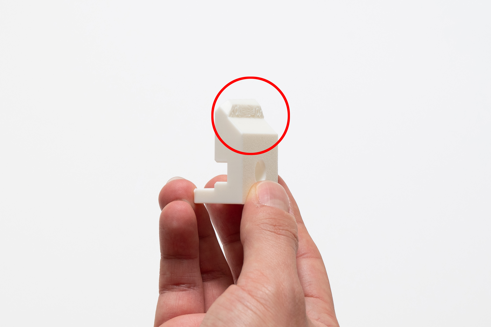
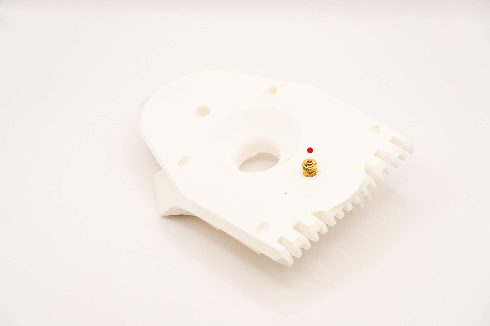
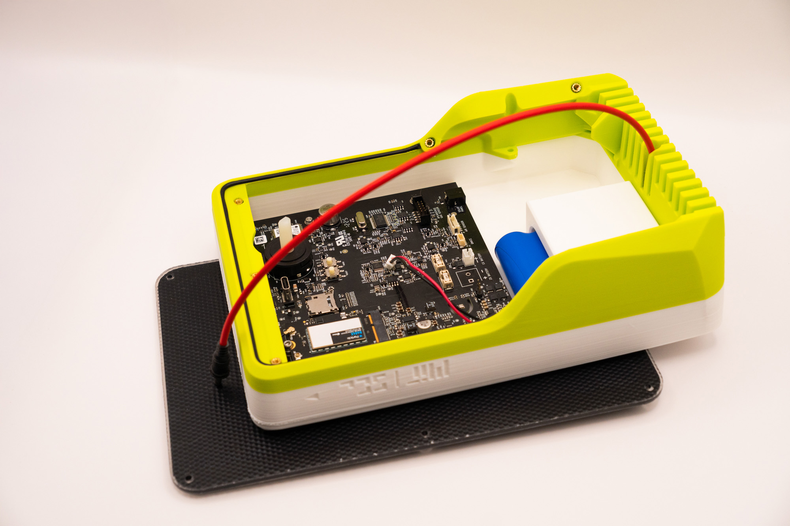

# 🧩 Assembly

:::info
It is highly recommended that you read this entire assembly manual to familiarize yourself before starting!
:::

## Overview

The assembly process consists of **15 easy steps**, which should take up to **60 minutes** per device.

The device was designed for not needing wire soldering, glueing or any other complex operation.

You will be installing brass inserts into plastic, placing parts together, connecting cables and fastening screws.

## Safety

:::danger

1. Be aware of the soldering iron tip and hot parts to **avoid burning** yourself and the 3d printed parts.
2. The metal inserts will keep **hot for a while** after inserting, especially the bigger 1/4" ones.
   :::

## Step 1 – Setup and Preparation

1. Make sure there is enough space and lighting;
3. Have all parts and components accessible on bench, placing the smallest ones on "buckets" to avoid losing them;
2. Leave the center of the bench for where the actual work is going to be, and the perimeter for tools and other parts;
4. Keep dangerous tools such as the soldering station away from where you could accidentaly hit it by mistake.

:::info
Meanwhile, you can always consult the [**overview reference**](overview), [**bill of materials**](bom) and [**suggested tools**](tools) throughout the process.
:::

<!-- ## Step 2 – Remove Printed Supports

Remove the support on _middle_ piece:

Remove the support on _camera_ piece:
 -->

## Step 2 – M2 Inserts

:::tip

- It is easy to misplace the inserts, pay attention to the **indicated spots** on the images.
- The **larger holes** are meant for the **1/4" inserts**, the **medium for M3** and **smaller for M2**.
- After the inserts are melted into the plastic they **cannot be easily removed** without damaging the 3d printed part.
- If in doubt, think twice and check the instructions!
  :::

Start by picking-up all the 13x M2 inserts

Of which, place 8x M2 inserts on _top_:

<!-- Then, place 4x M2 inserts on _camera_:

Finally, place the last 1x M2 insert on _switch_bottom_:
 -->

Set the soldering iron to 300ºC, wait for it to reach the temperature, then slowly press the soldering tip perpendicularly (avoid twisting) to the inserts until all them are flush with the printed surfaces:
<!-- 
 

 -->

In the end, this should be the result:

<!-- **✅ _switch_bottom_**

**✅ _camera_**
 -->

**✅ _top_**

## Step 3 – M3 Inserts

Pick-up 13x M3 inserts, turn the _top_ piece around, then place 6x M3 inserts on it:

<!--  -->

Then, install the 6x inserts with the soldering iron, turn the _top_ piece back and place the remaining 8x M3 inserts on the other side:

Pay attention to the appropriate angle, respecting the holes' directions and the surface alignment:

## Step 4 – 1/4" Inserts

Place 1x ¼" insert on the designated spot on _middle_ piece:

<!--  -->

:::tip
Be careful, these bigger inserts take longer to heat and to cool down.
:::

Then, place the other ¼" insert on the rear spot of the _bottom_ piece:
:::warning
Be careful to not place the insert in the wrong spot
:::

<!--  -->

**✅ Result**

## Step 5 – O-Ring Cord

Pick the O-ring cord and unroll it:

Align the tip of the cord to the recess on the _top_ piece, then gently press it perpendicularly to fit inside:

Without stretching, keep pressing until reaching the other extremity of the recess:

Cut the cord to match the extremity, and push it to finish:

**✅ Result**

## Step 6 – Populate Main Board

:::info
Remember to choose the type of Particle module (EMEA or US) according to where the device will be deployed.
:::

Insert the Particle module into the Main Board slot with its branding facing up:

Fasten the only 1x M2.5x4 screw into the Main Board to secure the module:

<!--  -->

Now, pick the GSM antenna cable and connect it between the Particle module and the Main Board:
:::tip

1. Depending on the Particle module type, the antenna connector will be in different place (always signed with a **_CELL_** label).
2. It can be tricky to snap the connector on. If needed, use a plier with care to not damage the connector and boards, pressing the connector from its front face, but **never press from the sides** because that will damage the connector.
   :::
   
   

To finish, add the microSD card to the Main Board slot:

**✅ Result**

## Step 7 – Battery and Main Board
To insert the Main Board into the _top_ piece, first place its front edge against the _top_ piece at an angle:

Finally, lower and then slide it back:

Place the battery on the _top_ piece, making sure the cable orientation follows the image:

Then, add the _battery_cover_:

**✅ Result**

<!--  -->
<!--  -->
<!-- Now, pick the Main Board and connect the battery cable: -->

## Step 8 – Secure Main Board

For fixing the Main Board, pick 4x M2 washers and put each into 4x M2X6 screws

<!--  -->

Fasten them into the four indicated holes:

**✅ Result**

## Step 9 – Solar Panel

Align the panel to make sure the cable is going out backwards, then pass it through the hole:

There are six holes to secure the solar panel to the _top_ piece. Pick up 6x M3X16 screws + 6x M3 washers and 6x 5mm spacers.

The correct order is **screw → washer → Solar Panel → spacer → _top_ piece**:

Start with both the intermediary holes, since that will make it easier to align the Solar Panel to the _top_ piece:

Proceed to the corners:
:::tip
Due to variation of manufacturing tolerances, it might be harder to fasten these corner screws.

Make sure the screw is properly aligned to the insert on the _top_ piece and fasten while making sure it is following the right angle.
:::

**✅ Result**

Please make sure there is no surplus of cable above the _top_ piece, all excess should be below:

Gently wind the cable while making sure it enters through the indicated spot on the back of the _top_ piece and respects the boundaries of its compartment above the _battery_holder_:

<!-- Attach the connector to the Main Board socket:
 --> 

## Step 10 – USB-C Cable

Pick the _Waterproof USB-C cable_:

Now, unscrew the cap and nut, remove them completely leaving the rubber seal, then put it back:

Place the cable in the appropriate place respecting the correct order of **cable screw → rubber ring → _middle_ piece**:

While holding everything together, turn the _middle_ piece around and add the cap ring, leaving its strip pointing to the right.

Fasten the nut while keeping the cap strip at the same position:

Screw the cap:

Connect the _90º USB-C adapter_ to the _Waterproof USB-C cable_ and twist the cable as indicated to help avoiding collision with other parts when finishing the assembly:

## Step 11 – Particulate Sensor

:::tip
Pay attention to the correct orientation, since there are several ways for assembling it wrong.
:::
Place the _Sensirion sensor_ into its craddle on the _middle_ piece:

Attach the cable to the _Sensirion sensor_:

:::tip
If you need, use a tweezer or screwdriver to help attaching the sensor properly to the end.
:::

<!-- To allow for the _middle_ piece to be attached to the _top_ piece correctly, align the switch longitudinally ("on" position):
 --> 

And turn the _Main Board_ switch until the green light turns on ("on" position):

Roll the Sensirion cable to remove the excess and connect it to the indicate spot:

## Step 12 – Switch & Closing

<!-- Connect the _90º USB-C Adapter_ to the _Main Board_:
 --> 

With care, align the _middle_ and _top_ pieces together while respecting the _switch_ position:

:::warning
Now you **must move back the switch** counter-clockwise to turn the device off.
:::

Fasten 3x M3x16 screws, joining the _middle_ and _top_ pieces together:

Align the _switch_top_ with the _top_ piece while respecting the _switch_ position:

Position the _bottom_ piece over the _top_ and _middle_ pieces:

Keep the cap strip out of the way:

Then insert it into the appropriate entrance on the right:

Place the last 4x M3x16 screws into the four bottom openings:

Fasten to hold it together with middle and top pieces:
:::tip
Due to the angles it might be more dificult to fasten the screws than usual.

Instead of fixing one at once then proceding to the next, it is easier if each one is tightened a bit at a time.
:::

**✅ Result**
:::warning
Make sure all seams are neatly aligned to avoid sealing issues.
:::

## Step 13 – Magnets

Fasten both _magnets_ into the _botton_ piece, making sure it is well tightened:

## Step 14 – Identification
:::tip
It is recommended to label each unit with a unique ID to avoid data identification issues:
:::

## You made it!

<!-- 
 -->
<!--  -->

<!--  -->

<!-- 

 -->

<!-- ARCHIVE --> 

<!-- ## Step 10 – Switch

Place the _switch_bottom_ into the _middle_ piece, from below:

Insert the o-ring into the _switch_top_, observing if it is perfectly fitting into its recess:

Align, then join the _switch_top_ and _switch_bottom_ with 1x M2X6 screw while keeping the _middle_ piece in between:

**✅ Result**
:::info
The switch must move freely between start and end, but there should be no play between the three parts.
:::

 --> 

<!-- ## Step 12 – Sensing Board

:::info
Depending on your needs, choose the appropriate gas sensor: CO+NO2 or O3+NO2 (depicted).
:::

First, start by assembling the desired Alphasense AFE board module into the Sensor Board:

:::warning
Make sure the module is properly aligned, because it is easy to attach it wrong.

The module sides must be parallel, and aligned to the Sensing Board edges.
:::

To place the Sensing Board into the _top_ piece, fit it into the back part while keeping it angled:

Swing it down, while paying attention to the fitting on the left side:

Finally, slide the Sensing Board away, making sure the Solar Panel cable is on the proper place:

To secure the Sensing Board, pick 1x M3X16 screw with 1x M3 washer and fasten it into the right hole.

:::warning
Do not fasten the M3 screw excessively or you might damage the Sensing Board.

It should be enough just for the Sensing Board to be held at place
:::

Finally, pick 1x M2X6 screw with 1x M2 washer to used on the left hole.
:::tip
This is trickier since the screw needs to be put underneath the Alphasense AFE board.

You can raise it a little bit if needed, making sure it doesn't get disconnected.
:::

**✅ Result**

## Step 13 – Main Cable

The main cable connects the Main Board with the Sensing Board.

:::tip
The cable has no specific start or end, but its connectors has only one way to be inserted.
:::

First, connect the cable to the Sensing Board:

Then, connect the cable to the Main Board:

To organize the cables, place them underneath the Alphasense AFE board.

**✅ Result**

## Step 14 - Camera Cable

Now you can connect the camera cable, beginning with the camera:

:::tip
You might carefully use a tweezer or screwdriver to gently push the connector, but take care to not damage anything.
:::

Finally, connect the cable to the Sensing Board:
 --> 
