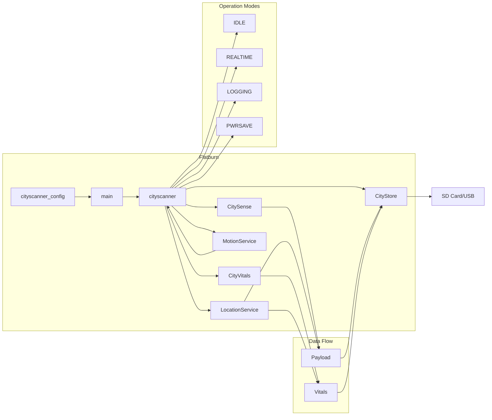

# 💻 Firmware

## Environment

- Code developed using [Particle.io plugin for MS Code](https://www.particle.io/workbench/);
- Devices can be flashed both via cable or cloud flash (data costs);
- Currently testing on bsom [Particle deviceOS@6.1.1](https://docs.particle.io/reference/device-os/firmware);
- Written in C++ and [Particle deviceOS APIs](https://docs.particle.io/reference/device-os/firmware/);

## Dev Environment Setup

1. Clone [this](https://github.com/MIT-Senseable-City-Lab/flatburn-lte/) repository;
2. Open Particle Workbench;
3. Run the `Particle: Import Project` command, follow the prompts, and wait for the project to load;
4. Run the `Particle: Configure Workspace for Device` command and select a compatible Device OS version and the `bsom` platform when prompted ([docs](https://docs.particle.io/tutorials/developer-tools/workbench/#cloud-build-and-flash));
5. Connect your device;
6. Compile & Flash!

## Main Firmware Functionalities
- Cityscanner: Handles operation modes;
- CitySense: Collects environmental data (payload);
- CityVitals: Collects telemetry/status (vitals);
- CityStore: Handles SD card and USB data storage/transfer;
- MotionService: Puts device to sleep when vehicle is not moving;
- LocationService: Provides GPS data;

## Block Diagram

## Operation modes

- _IDLE_ sensors off, provides only telemetry data;
- _REALTIME_ logs data onto the SD card and send it in real time (via Particle publish);
- _LOGGING_ buffer data onto the SD card and send multiple records upon request (via USB);
- _PWRSAVE_ ike LOGGING but in low power mode.

### Payload

| # | Element             | Type         | Purpose                                | Source                   |
|---|---------------------|-------------|----------------------------------------|--------------------------|
| 0 | deviceID            | identifier  | Unique device identifier from particle               | Partile module         |
| 1 | timestamp           | temporal    | UTC time of measurement                | GPStime in Epoch        |
| 2 | latitude            | spatial     | Latitude (decimal degrees)             | GPS module   |
| 3 | longitude           | spatial     | Longitude (decimal degrees)            | GPS module    |
| 4 | PM1.0               | atmospheric | Particulated Matter (1 μm)             | Sensirion SPS30          |
| 5 | PM2.5               | atmospheric | Particulated Matter (2.5 μm)           | Sensirion SPS30          |
| 6 | PM4                 | atmospheric | Particulated Matter (4 μm)             | Sensirion SPS30          |
| 7 | PM10                | atmospheric | Particulated Matter (10 μm)            | Sensirion SPS30          |
| 8 | numPM0.5            | atmospheric | Particle count (0.5 μm)                | Sensirion SPS30          |
| 9 | numPM1              | atmospheric | Particle count (1 μm)                  | Sensirion SPS30          |
| 10| numPM2.5            | atmospheric | Particle count (2.5 μm)                | Sensirion SPS30          |
| 11| numPM4              | atmospheric | Particle count (4 μm)                  | Sensirion SPS30          |
| 12| numPM10             | atmospheric | Particle count (10 μm)                 | Sensirion SPS30          |
| 13| PM size             | atmospheric | Average particle size                  | Sensirion SPS30          |
| 14| temperature         | atmospheric | Ambient air temperature (°C)           | BME280             |
| 15| humidity            | atmospheric | Ambient relative humidity (%)          | BME280             |
| 16| gas_op1_w           | air quality | Gas sensor 1 (write pin)               | Alphasense AFE       |
| 17| gas_op1_r           | air quality | Gas sensor 1 (read pin)                | Alphasense AFE       |
| 18| gas_op2_w           | air quality | Gas sensor 2 (write pin)               | Alphasense AFE       |
| 19| gas_op2_r           | air quality | Gas sensor 2 (read pin)                | Alphasense AFE       |
| 20| noise               | sound       | Environmental noise in (dB)               | Alphasense AFE       |

---

### Vitals

| # | Element          | Type        | Purpose                                  | Source                   |
|---|------------------|------------|------------------------------------------|--------------------------|
| 0 | deviceID         | identifier | Unique device identifier from particle                 | Particle module          |
| 1 | timestamp        | temporal   | UTC time of measurement                  | GPStime in Epoch        |
| 2 | latitude         | spatial    | Latitude (decimal degrees)               | GPS module    |
| 3 | longitude        | spatial    | Longitude (decimal degrees)              | GPS module    |
| 4 | voltage_batt     | electrical | Battery voltage (V)                      | Battery IC    |
| 5 | current_batt     | electrical | Battery current (mA)                     | Battery IC    |
| 6 | isCharging       | status     | Charging status (boolean)                | Firmware |
| 7 | isCharginS       | status     | Secondary charging status (boolean)      | Firmware       |
| 8 | isCharged        | status     | Battery fully charged                    | Firmware       |
|11 | voltage_solar    | electrical | Solar panel voltage (V)                  | Solar      |
|12 | current_solar    | electrical | Solar panel current (mA)                 | Solar      |
|13 | cell_strength    | signal     | Cellular network signal strength         | Cellular RSSI |

# Command line interface

A Python script provides a command line interface (CLI) for retrieving data over USB. To use it, follow the step-by-step instructions in the [data retrieval guide](https://mit-senseable-city-lab.github.io/flatburn-lte/deploy/data)
