# 🧭 Device


Brief description on the its purpose and why it is relevant to have such custom device made.

## Sensors

```mermaid
mindmap
    root((**SENSING**))
        Temperature
        Humidity
        Particulate Matter
            PM1.0
            PM2.5
            PM4
            PM10
        Gases
            CO
            NO2
            O3
            ...
        Thermal Infrared Image
        Noise
        Road Quality – IMU
        Position – GPS
```

<div style={{textAlign: 'center'}}>



</div>

### 📷 Thermal Imaging

<!--  -->

Thermal imaging can be used to assess the energy efficiency of building envelopes, monitor infrastructure, and study the impact of anthropogenic heat in the cities (e.g. Urban Heat Island effect).

### 💨 Particulate Matter

<!--  -->

City Scanner counts particles in different diameter size bins (PM1.0, PM2.5, PM4 and PM10) using a small laser.

The particle counts are an indicator to determine signatures of different pollution sources. This data can inform epidemiological research and urban health policies.

### 🌡️ Temperature & 💧 Humidity

<!--  -->

City Scanner includes low-cost temperature and humidity sensors that can be used to understand pedestrian activities as well as heat islands in urban areas.

### 🎤 Noise Levels

The device carries an internal microphone able to capture noise from surroundings.

### 🚎 Road Quality

<!--  -->

Using accelerometers, City Scanner identifies road quality based on the vehicle vibrations.

City Scanner literally creates a roadmap for improving roads.

## Power

### ☀️ Solar Energy

Whenever the sun is shining the device is able to charge its battery while operating.

### 🔋 Battery

If either the day is cloudy, or it is in a shade, the device is able to run for _⚠️ N hours_ without needing to charge on an outlet.

## Connectivity

### 🌎 Particle GSM

By using a [Particle](https://www.particle.io/) module, the device automatically gathers data and send it to the cloud, and might have its firmware updated remotely as well.

<div style={{textAlign: 'center'}}>
 ```mermaid
graph BT;

    A[/Sensing\] --> D1
    B[/Sensing\] --> D2
    C[/Sensing\] --> D3
    D[/Sensing\] --> D4

    D1(<b>Device #01</b>) -.-> |GSM| E
    D2(<b>Device #02</b>)  -.-> |GSM| E
    D3(<b>Device #03</b>)  -.-> |GSM| E
    D4(<b>Device #...</b>)  -.-> |GSM| E{Back-end}

    E ==> F[(Database)]

```
</div>

