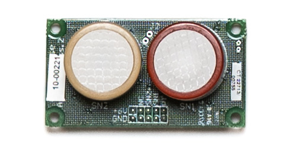

# 🧭 Device

The Flatburn LTE device is based on almost a decade of experience in drive-by sensing, which resulted in a sturdy and compact device that can be deployed on vehicles of different sizes. See below all its features in depth.


## Sensing


<div style={{textAlign: 'center'}}>


</div>

### 📷 Thermal Imaging

<!--  -->
<div style={{display: "flex", justifyContent:"space-between"}}>
    <div style={{width: "49%"}}>
        
    </div>
    <div style={{width: "49%"}}>
        
    </div>
</div>
_Sensor: MLX90640 (110º FoV)._

Thermal imaging can be used to assess the energy efficiency of building envelopes, monitor infrastructure, and study the impact of anthropogenic heat in the cities (e.g. Urban Heat Island effect).

The thermal camera is protected by a sealed germanium flat lens, which allows infrared frequencies to be captured.

### 💨 Gases

<div style={{display: "flex", justifyContent:"space-between"}}>
    <div style={{width: "49%"}}>
        
    </div>
    <div style={{width: "49%"}}>
        
    </div>
</div>


_Sensor: Alphasense._

By using Alphasense platform for sensing gases, it is possible to mount up to two different sensors using the same base configuration, such as CO, NO2 or O3.

### ☁️ Particulate Matter

<!--  -->
<div style={{width: "49%"}}>
    
</div>
_Sensor: Sensirion SPS30._

City Scanner counts particles in different diameter size bins (PM1.0, PM2.5, PM4 and PM10) using a small laser.

The particle counts are an indicator to determine signatures of different pollution sources. This data can inform epidemiological research and urban health policies.

### 🌡️ Temperature & 💧 Humidity

<!--  -->

<div style={{display: "flex", justifyContent:"space-between"}}>
    <div style={{width: "49%"}}>
        
    </div>
</div>

_Sensor: Bosch BME280_

City Scanner includes low-cost temperature and humidity sensors that can be used to understand pedestrian activities as well as heat islands in urban areas.

### 🎤 Noise Levels

<div style={{display: "flex", justifyContent:"space-between"}}>
    <div style={{width: "49%"}}>
        
    </div>
</div>

_Sensor: CUI DEVICES CMM-2718AT-42316-TR MEMS Microphone_

The device carries an internal microphone able to capture noise from surroundings.

### 🛰️ Position & 🚎 Road Quality

<!--  -->

<div style={{display: "flex", justifyContent:"space-between"}}>
    <div style={{width: "49%"}}>
        
    </div>
</div>

_Sensor: u-blox NEO-M8U-06B_

The GPS sensor provides location, and also accelerometer data to identify road quality based on the vehicle vibrations.

City Scanner literally creates a roadmap for improving roads.

## Power

### ☀️ Solar Energy

Whenever the sun is shining the device is able to charge its battery while operating.

### 🔋 Battery

If either the day is cloudy, or it is in a shade, the device is able to run for _⚠️ N hours_ without needing to charge on an outlet.

## Connectivity

### 🌎 Particle GSM

<div style={{display: "flex", justifyContent:"space-between"}}>
    <div style={{width: "49%"}}>
        
    </div>
    <div style={{width: "49%"}}>
        
    </div>
</div>

By using a [Particle](https://www.particle.io/) module, the device automatically gathers data and send it to the cloud, and might have its firmware updated remotely as well.

It is possible to select between US (B404) and EU (B524), depending on where the device will be deployed.

<div style={{textAlign: "center"}}>
 ```mermaid
graph BT;

    A[/Sensing\] --> D1
    B[/Sensing\] --> D2
    C[/Sensing\] --> D3
    D[/Sensing\] --> D4

    D1(<b>Device #01</b>) -.-> |GSM| E
    D2(<b>Device #02</b>)  -.-> |GSM| E
    D3(<b>Device #03</b>)  -.-> |GSM| E
    D4(<b>Device #...</b>)  -.-> |GSM| E{Back-end}

    E ==> F[(Database)]

```
</div>

## Weather Resilience

### ☔️ Sensing Chamber

Inspired by the nasal cavity. Just like our brains, all sensitive electronics are positioned in a monolithic enclosure and above the air intake, avoiding the water entrance.


The sensors that need to be in contact with the exterior are protected by grilled nostrils that slows the airspeed to avoid misreadings and allows for fast sensor response times. Any eventual accumulated moisture is easily drained through internal slopes.


### 🤿 Sealed I/Os

Both the **on–off switch** and the **USB-C port** are sealed for protection while keeping their core functionalities.
<div style={{display: "flex", justifyContent:"space-between"}}>
    <span style={{width: "49%"}}>
        
    </span>
    <span style={{width: "49%"}}>
        
    </span>
</div>

The USB-C can be used to charge the device, flash firmware, debug and retrieve data.
<div style={{display: "flex", justifyContent:"space-between"}}>
    <span style={{width: "32%"}}>
        
    </span>
    <span style={{width: "32%"}}>
        
    </span>
    <span style={{width: "32%"}}>
        
    </span>
</div>


## Practicity

### 🧲 Magnetic Mount

The two magnets on the bottom make it easy to **attach the device to any ferromagnetic material**, such as most of automobile roofs.
<div style={{display: "flex", justifyContent:"space-between"}}>
    <div style={{width: "49%"}}>
        
    </div>
    <div style={{width: "49%"}}>
        
    </div>
</div>
Alternatively, the magnets can be removed, leaving the rear standard camera 1/4" thread to **mount the device with other accessories.**

### 💼 Light and Compact

Each unit weighs 1.5kg, and at least 5 devices can be fitted inside a small carry-on bag.


<div style={{display: "flex", justifyContent:"space-between"}}>
    <div style={{width: "48%"}}>
        
    </div>
    <div style={{width: "48%"}}>
        _image with overall dimensions_
    </div>
</div>
