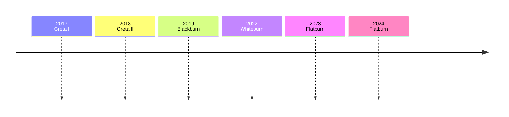

# ♾️ Evolution

What we discover when we turn urban vehicles into sensing platforms.

### 2024 Flatburn

_Stockolm (2024), Bologna (2024)_

### 2023 Flatburn

_Beirut (2023), Amsterdam (2023)_

### 2022 Whiteburn

_Boston (2019), New York (2020), Stockholm (2021), Oskemen (2021), Beirut (2022)_

### 2019 Blackburn

_Boston (2019)_

### 2018 Greta II

_Boston (2018), New York (2018)_

### 2017 Greta I

_Boston (2017)_

